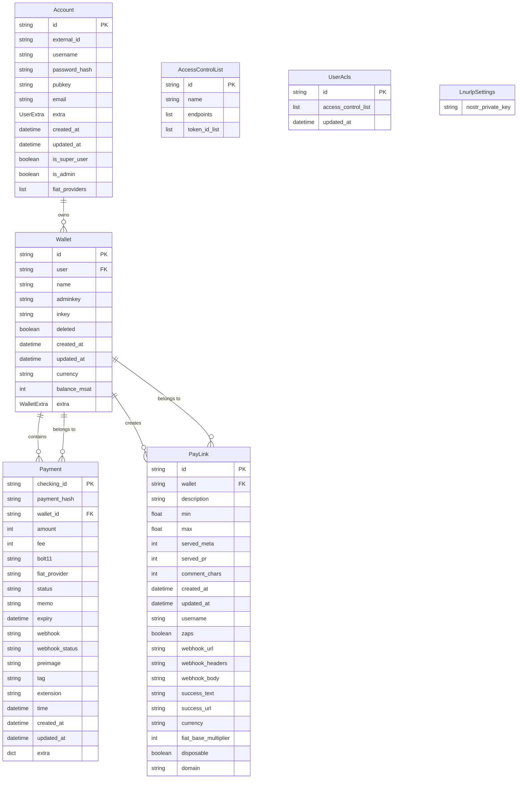

# LNbits Database Schema - Visual Diagram

## Entity Relationship Diagram

## Table Categories Legend

### 🔵 Core Admin/System Tables
- **Account**: User account management
- **AccessControlList**: API access control
- **UserAcls**: User access control lists

### 🟢 Core User Data Tables  
- **Wallet**: Lightning wallet management
- **Payment**: Payment transaction records

### 🔴 LNURLp Extension Tables
- **PayLink**: Static payment links and Lightning Addresses
- **LnurlpSettings**: Extension configuration

## Key Relationships

1. **Account → Wallet**: One-to-Many (User owns multiple wallets)
2. **Wallet → Payment**: One-to-Many (Wallet contains multiple payments)
3. **Wallet → PayLink**: One-to-Many (Wallet can create multiple pay links)

## Extension Integration Points

- **LNURLp Extension**: Integrates with core `Wallet` table to create payment links
- **Payment Tracking**: All extensions can create entries in the core `Payment` table
- **User Context**: Extensions operate within the user context established by `Account` table

## Database Features

- **Soft Deletes**: Uses `deleted` flags instead of hard deletes
- **Audit Trails**: `created_at` and `updated_at` timestamps on all tables
- **Webhook Support**: Built-in webhook functionality for payments
- **Multi-Currency**: Support for various currencies and fiat providers
- **Nostr Integration**: Support for Nostr zaps in LNURLp extension

## Color Coding for Visual Tools

When using database visualization tools like DbSchema or ChartDB, use this color scheme:

- **🔵 Blue (#0066CC)**: Core admin/system tables
- **🟢 Green (#00AA44)**: Core user data tables  
- **🟡 Yellow (#FFAA00)**: Core system/node tables
- **🔴 Red (#CC0000)**: LNURLp extension tables
- **🟠 Orange (#FF6600)**: Boltcards extension tables
- **🟣 Purple (#6600CC)**: LNURLw extension tables
- **⚫ Black (#333333)**: Other extension tables

## Implementation Notes

- **Primary Keys**: All tables use string-based UUIDs as primary keys
- **Foreign Keys**: Clear relationships between core and extension tables
- **Extensibility**: Extension tables reference core tables but don't modify them
- **Data Integrity**: Soft deletes and audit trails maintain data integrity
- **Scalability**: Modular design allows for easy addition of new extensions
